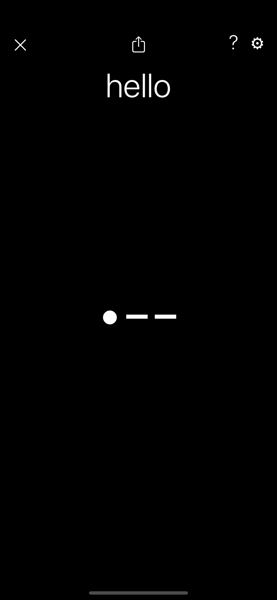
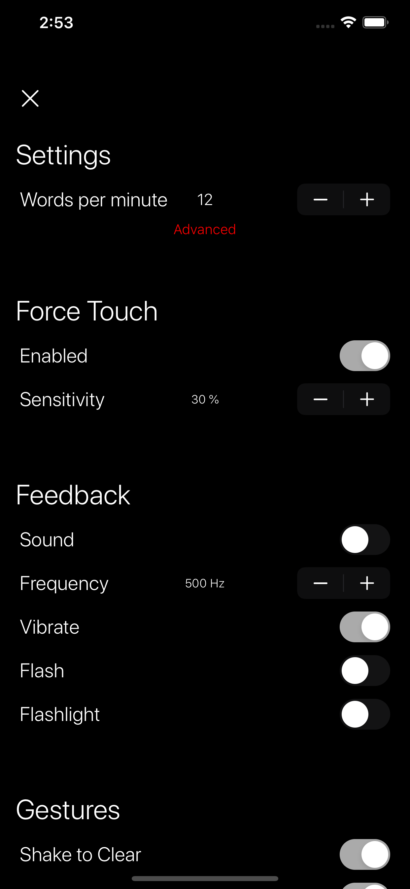

# Force Code

## Overview
This is a simple iOS App which allows you to enter and share Morse code. It supports the Force Touch feature of iOS devices which makes it unique, as far as I know. 

Force Touch can be useful if you prefer not to lift your finger from the screen, or simply can't due to physical limitations.

This code also has an implementation of the [PARIS words-per-minute algorithm using Farnsworth spacing](http://www.arrl.org/files/file/Technology/x9004008.pdf)... which is cool.